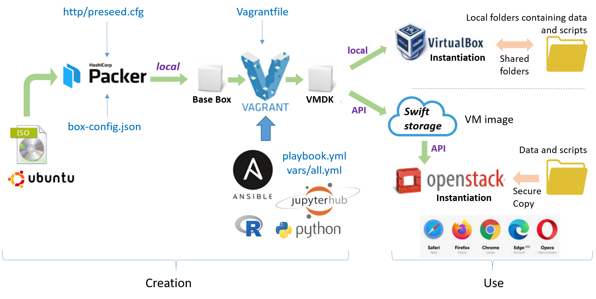

## Purpose

Building automation of a virtual machine (VM) from a server install image of ubuntu (ISO file)

* based on [ubuntu 22.04 LTS](https://releases.ubuntu.com/jammy/)
* containing R software version 4.5 with useful packages and _The Littlest JupyerHub_ ([TLJH](https://tljh.jupyter.org/en/latest/))
* with the help of _Packer_, _Vagrant_ and _Ansible_ tools 
* for using with _VirtualBox_ or _OpenStack_.


For more details on the whole process, see https://inrae.github.io/jupyterhub-vm/

### Creation and configuration of a virtual machine

Requires [VirtualBox](https://www.virtualbox.org/), [Packer](https://www.packer.io/), [Vagrant](https://www.vagrantup.com/) to be installed beforehand.

* **VirtualBox**: this is what we call the [provider](https://www.vagrantup.com/docs/providers). If the objective is to use the VM on his desktop computer, then the VM will have to run in _VirtualBox_. If the objective is to use the VM in the cloud (_OpenStack_ for example), then _VirtualBox_ is only used here as an intermediary to build the VM.

* **Packer** : allows the creation of a virtual machine from an ISO, having a very precise control over its characteristics. Here it will allow us to build a VM compatible with the Vagrant tool, called a box.

* **Vagrant** : allows building virtual machines from basic building blocks called [boxes](https://app.vagrantup.com/boxes/search) for [Providers](https://www.vagrantup.com/docs/providers) by [provisioning](https://www.vagrantup.com/docs/provisioning) them by _Provisioners_ such as [Ansible](https://docs.ansible.com/ansible/latest/index.html).

* **Ansible** which is a powerfull tool allowing to describe tasks using [Playbooks](https://docs.ansible.com/ansible/latest/user_guide/playbooks.html), then turn tough tasks into repeatable playbooks. It is **not necessary to install Ansible** beforehand. It will be installed temporarily on the virtual machine to proceed the [provisionning](https://www.vagrantup.com/docs/provisioning). It will be removed at the end of the VM creation.

The entire process is summarized below in diagram form: 


* **Input**:  an ISO file corresponding to the chosen operating system, downloaded from the Internet
* **Output**:  an instance of the operational virtual machine on an OpenStack Cloud (e.g. [Genouest OpenStack cloud](https://www.genouest.org/2017/03/02/cluster/)); in the upper part, all the configuration files used for the automatic generation of the virtual machine.

<br>

**Implementation** : The workflow implementation was carried out with _Packer v1.15.0_, _Vagrant 2.4.9_ and _VirtualBox 7.2.6_.  The environment being tested is under _Windows 11 25H2 64-bit_ with _Cygwin 3.4.10_. However, a recent version of Ubuntu is highly advantageous.

<br>

### 1 - Get the ISO file

* Download Ubuntu 22.04 iso file - See https://cdimage.ubuntu.com/ubuntu/releases/22.04/release/

* Example :

```
ISO : https://releases.ubuntu.com/22.04/ubuntu-22.04.5-live-server-amd64.iso
CHECKSUM : sha256:9bc6028870aef3f74f4e16b900008179e78b130e6b0b9a140635434a46aa98b0
```

<br>

### 2 - Create the Base Box

* The tested version is _Packer v1.15.0_

* Base Box with Packer, see : https://dev.to/miry/getting-started-with-packer-in-2024-56d5

    * [box-config.json](box-config.json) : VM Settings
    * [http/user-data](http/user-data) : Cloud-Init Configuration

```
cd  ./jupyterhub-vm
time packer build box-config.json | tee ./logs/packer.log
```

* The **base box** should now be located in the -./builds- directory and be named -virtualbox-ubuntu2204.box_.

* You can now delete the **ISO file** as it will no longer be needed in the following steps.

<br>

### 3 - Store Base Box in Vagrant Cloud

* In order to be able to use this base box in several projects, the best option is to store it in the Vagrant cloud. To do this, use the web interface. Before uploading your base box you must complete the following tasks (if not yet done) : 1) create an account, 2) create a projet, 3) create a registry within the projet. Then 4) create a _base box_. See https://developer.hashicorp.com/vagrant/vagrant-cloud/boxes/create.

* Here we have created the base boxe referenced as [djreg/small-ubuntu2204](https://portal.cloud.hashicorp.com/vagrant/discover/djreg/small-ubuntu2204/versions/1.1)

<br>

### 4 - Create Final VM

* The tested version is _Vagrant 2.4.9_

* Based on :
   * [Base Box](https://portal.cloud.hashicorp.com/vagrant/discover/djreg/small-ubuntu2204/versions/1.1) : the base box stored in the Vagrant Cloud (see previous step)
   * [Vagrantfile](Vagrantfile) : describes the type of the machine and how to configure and provision it. 
   * [ansible](ansible/playbook.yml) : configures the installation of the VM and the packages, modules, etc.

* You must first install the plugin corresponding to the provider (_VirtualBox_) if not yet done

* You have also to create a new [_VirtualBox Host-Only Ethernet Adapter_](images/vbox_network.png)

```
vagrant plugin install virtualbox
```

* Then, you can now build the final VM

```
time vagrant up | tee logs/vagrant.log
```

* At this stage, you can use the final VM given that it is running on the provider (_VirtualBox_). So you can connect on it using ssh command (login=_vagrant_, password=_vagrant_):

```
ssh -p 2222 vagrant@127.0.0.1
```

* You can also access the JupyterHub web interface at http://192.168.99.1/ (or another IP address depending on the one specified in the [Vagrantfile](Vagrantfile) and [ansible/vars/all.yml](ansible/vars/all.yml) files).

* **Note 1** : If you wish, you can add one or more SSH keys to the _scripts/ssh_keys_ file, which will then be associated with the root account. This will allow you to log in directly as root. Very practical in development mode but to be avoided in production mode, given that the _vagrant_ account already has full rights with the sudo mechanism.

* **Note 2** : A shell script ([_/usr/local/bin/install_R_pkgs_](ansible/roles/r_pkgs/files/install_R_pkgs)) has been created to install a set of R packages from various sources (CRAN, bioconductor, github, ...). This script can be edited either before building the VM or afterward within the VM itself. However, in both cases, it must be executed from within the VM. This allows for a more generic and smaller VM, and enables the creation of multiple instances from the same image for different uses, i.e., for different application domains.

<br>

### 5 - Export Final VM

* Export the final VM as a TAR archive (_tar.gz_ format). It will included the VMDK VM file (_ubuntu2204-disk001.vmdk_)

```
time vagrant package --output ./builds/ubuntu2204-box.tar.gz | tee -a ./logs/vagrant.log

```
<br>

### 6 - Upload Final VM on an OpenStack cloud

* First you must extract the VMDK VM file (_ubuntu2204-disk001.vmdk_) from the TAR archive. Put it under the same directory (i.e. _./builds_)

* Upload the final VM on a OpenStack cloud, based on :
    * [OpenStackClient](https://docs.openstack.org/python-openstackclient/latest/) (OSC) which must be installed
    * [clouds.yaml](openstack/README.md) : definition file of the openstack cloud (e.g. [GenOuest](https://www.genouest.org/2017/03/02/cluster/))
    * [openstack/push_cloud.sh](openstack/README.md) : shell script that does the job

* Note : Depending on your network connection, this may take a long time (from 2 min. up to 30 min.).

```
time sh ./openstack/push_cloud.sh -c genostack | tee ./logs/genostack.log
```

* You will be asked for a password

```
Please enter your OpenStack password, then [shift][Enter] :
```

* **Note 1** : Once the VM image has been placed in the cloud space and an instance created, you will need to edit the _/usr/local/bin/get-hostname_ file to indicate either the full name of the instance or the IP address depending on what is needed to access it on the Internet. By default, the local IP address is provided. However, this may not work if the VM is behind a proxy.

* **Note 2** : You can go further and automate the creation of a functional instance on the cloud. See [more details](openstack/README.md)

<br>

### 7 - Do the housework on your local disk


* Stop the VM if not yet done

```
vagrant halt -f default
```

* Remove the final VM from the provider (_VirtualBox_)

```
vagrant destroy -f default
```

* Remove the current virtual environment

```
rm -rf ./.vagrant
```

* Delete the files corresponding to the base box and the final virtual machine (under ./builds)

```
rm -f ./builds/*
```

* Optionally remove the base box from the local vagrant registry 

```
rm -rf $HOME/.vagrant.d/boxes/djreg-*
```

<br>

### Acknowledgements

We would like to thank the [IFB GenOuest bioinformatics](https://www.genouest.org/2017/03/02/cluster/) for providing storage and computing resources on its national life science Cloud.

<br>

### Funded by:

* INRAE UR BIA-BIBS, Biopolymères Interactions Assemblages
* INRAE, UR BIA, plate-forme BIBS

<br>

### License

Copyright (C) 2026  Daniel Jacob - INRAE

    This program is free software: you can redistribute it and/or modify
    it under the terms of the GNU General Public License as published by
    the Free Software Foundation, either version 3 of the License, or
    (at your option) any later version.

    This program is distributed in the hope that it will be useful,
    but WITHOUT ANY WARRANTY; without even the implied warranty of
    MERCHANTABILITY or FITNESS FOR A PARTICULAR PURPOSE.  See the
    GNU General Public License for more details.

    You should have received a copy of the GNU General Public License
    along with this program.  If not, see <http://www.gnu.org/licenses/>.
