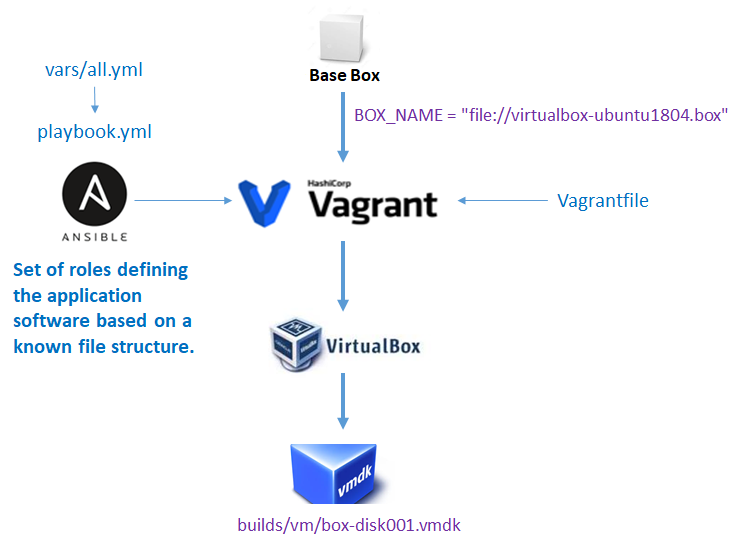

# Final VM

<style>.md-typeset h1 {display: none;} .md-nav__item {font-size: medium}</style>

#### Starting from an existing base VM (Base box)

Creating a base VM can be complex for a non-expert. This is why it is easier to start from a base VM when it is available. This is also why the base VM should be as generic as possible so that it can be easily used for many applications.

The base VM generated and used in this use-case was deposited on [Vagrant Cloud][1]{:target="_blank"}, using its API (see [Registering a box on Vagrant Cloud](../basebox/#registering-a-box-on-vagrant-cloud)).

#### Building the final VM

We will use the base VM to provision it, i.e. install and configure all the system and application tools (packages) necessary to make the JupyterHub application work properly. To do this, we will use the Ansible tool as illustrated in the figure below:

<br>
<center>
<a href="../images/image2.png" data-lightbox="image2"></a>
</center><br><br>

**Note**: All the scripts and other configuration files mentioned in this description can be found in free access under the [GiHub INRAE repository][14]{:target="_blank"}.

The first step is to create a [Vagrantfile][2]{:target="_blank"} and customise it to suit your needs. This file follows the syntax of the [Ruby language][3]{:target="_blank"}. A light version is given below:

```
  Vagrant.configure("2") do |config|
  
    config.vm.box = file://builds/virtualbox-ubuntu1804.box
    config.vm.hostname = jupyterhub
  
    config.vm.network "private_network", type: "dhcp"
  
    config.ssh.insert_key = false
  
    config.vm.synced_folder ".", "/vagrant", type: "virtualbox"
        
    config.vm.provision "ansible_local" do |ansible|
        ansible.playbook = "ansible/playbook.yml"
        ansible.install = true
        ansible.limit = 'all'
    end
  
    config.vm.provision "shell", path: "scripts/cleanup.sh"
  
  end
```

* *config.vm.box*
    * sets the base box as input
* *config.vm.hostname*
    * defines the hostname of the machine
* *config.vm.network*
    * defines the network configuration in DHCP mode
* *config.ssh.insert_key*
    * defines the SSH key. By default, it will be the one defined in the base box.
* *config.vm.synced_folder*
    * defines a local directory as shared with the VM. At least, the "." directory must be defined in order to configure the VM. These shared directories will only be active during the creation and then test stage before export.
* *config.vm.provision*
    * defines the process by which the VM will be provisioned. Here, two processes are invoked. i) 'ansible_local': indicates that the ansible tool will first be installed on the VM and then use the playbook defined in ansible/playbook; ii) 'shell': indicates that a shell script defined by its relative path will be used.

#### Provisioning using the Ansible tool

The choice was made not to install Ansible on the host machine used to create the VM, but rather it will be installed on the VM itself, this is to simplify the process.

The provisioning is defined from a [YAML][4]{:target="_blank"} file called [playbook.yml][5]{:target="_blank"}

```
  ---
- hosts: all
  become: true
  become_user: root
  #gather_facts: no

  vars_files:
    - vars/all.yml

  environment:
    PYTHONHTTPSVERIFY: 0

  roles:
    - repositories
    - server
    - vm
    - install-r
    - jupyterhub
    - r_pkgs
    - python_pkgs
```

Ansible allows tasks to be organised in a directory structure called a [Role][6]{:target="_blank"}. In this configuration, playbooks invoke roles, which themselves define a set of tasks, so you can always group tasks together and reuse roles in other playbooks. Roles also allow you to collect templates, static files and variables along with your tasks in a structured format. 

Each role, and then each task within roles, is interpreted sequentially. Thus the following roles are defined:

* *repositories*
    * configures the repositories for binary packages (systems, R, python, tools, ...), 
* *server*
    * configure the timezone 
* *vm*
    * configure the hostname
* *install-r*
    * installs the R application with basic packages
* *jupyterhub*
    * installs and configures the jupyterhub application
* *r_pkgs*
    * install a set of R packages
* *python_pkgs*
    * install a set of Python packages

Each role is defined by a set of tasks, themselves defined by files in YAML format.

For example, the role '*repositories*' is defined by the following *roles/repositories/tasks/main.yml* file:

```
---

- name: Add an apt key by id from a keyserver
  apt_key:
    keyserver: "{{repository.keyserver}}"
    id: "{{repository.id}}"

- name: Add repositories
  apt_repository:
    repo: "{{item}}"
  with_items: "{{repository.repos}}"

```

Two tasks are thus defined and described by their name field. Then the actual task is defined using a name referring to a [module][7]{:target="_blank"}. [Hundreds of modules][8]{:target="_blank"} are available in Ansible. Here two modules are invoked:

* [apt_key][9]{:target="_blank"}: add or remove an apt key
* [apt_repository][10]{:target="_blank"}: add or remove a binary package repository. The [variables][11]{:target="_blank"}  defined by the double braces {{ }} correspond to those defined in the *vars/all.yml* file itself declared in the playbook. Thus the following lines can be found in this file:

```
repository:
    keyserver: hkp://keyserver.ubuntu.com:80
    id: E298A3A825C0D65DFD57CBB651716619E084DAB9
    repos:
      - ppa:c2d4u.team/c2d4u4.0+
      - ppa:hnakamur/libgit2
      - deb https://cloud.r-project.org/bin/linux/ubuntu bionic-cran40/
```

So this is how the provisioning task set is defined by Ansible. 

The '*jupyterhub*' role was built from the instructions provided on the [TLJH][12]{:target="_blank"} website. The list of Python and R packages needed for a specific use under JupyterHub are to be defined in the *vars/all.yml file*, whose installation is taken care of by the '*python_pkgs*' and '*r_pkgs*' roles respectively.
 
#### Shell script provisioning

Once the provisioning by Ansible is finished, we proceed to a VM cleanup, i.e. uninstall Ansible, clean the temporary files and clean the hard disk. We use a Shell script (*scripts/cleanup.sh*) for this.

#### Creating the final VM

Once the configuration is established, you just have to execute the following commands:

```
$> vagrant up
$> vagrant package --output ubuntu-box.tar.gz
```

All the messages produced can be consulted on the [github repository][13]{:target="_blank"}

<br><br><br>

[1]: https://app.vagrantup.com/GAEV/boxes/ubuntu1804-dd18Gb
[2]: https://www.vagrantup.com/docs/vagrantfile
[3]: https://www.ruby-lang.org/fr/about/
[4]: https://en.wikipedia.org/wiki/YAML
[5]: https://docs.ansible.com/ansible/2.4/playbooks_intro.html
[6]: https://docs.ansible.com/ansible/latest/user_guide/playbooks_reuse_roles.html
[7]: https://docs.ansible.com/ansible/latest/user_guide/modules_intro.html
[8]: https://docs.ansible.com/ansible/2.8/modules/list_of_all_modules.html
[9]: https://docs.ansible.com/ansible/2.8/modules/apt_key_module.html
[10]: https://docs.ansible.com/ansible/2.8/modules/apt_repository_module.html
[11]: https://docs.ansible.com/ansible/latest/user_guide/playbooks_variables.html
[12]: https://tljh.jupyter.org/en/latest/
[13]: https://github.com/inrae/jupyterhub-vm/blob/master/logs/vagrant.log
[14]: https://github.com/inrae/jupyterhub-vm
