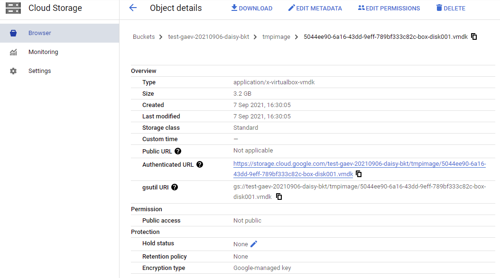
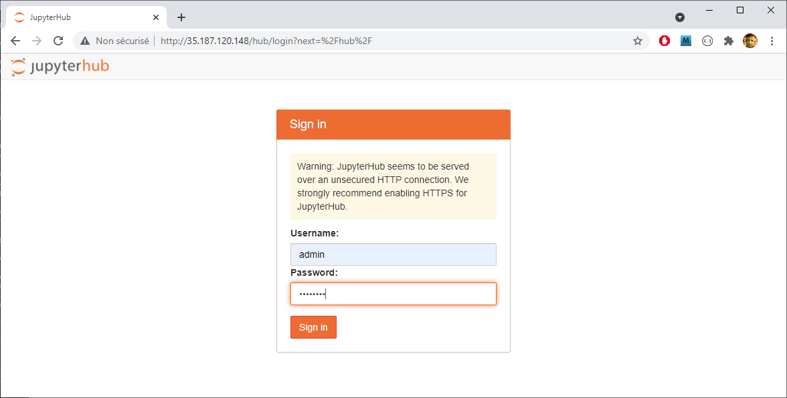

# Google Cloud

<style>.md-typeset h1 {display: none;} .md-nav__item {font-size: medium}</style>

### Using Google Cloud SDK

<br>

#### Before you begin

In order to use the final VM on GCP, you first need to go through the following steps:

* Assuming [your project is created][1]{:target="_blank"} (GCP), 
* Assuming your [SSH Keys defined at the level project][3]{:target="_blank"} (GCP)
* Assuming your SSH keys are available (added with [ssh-add][4]{:target="_blank"}, a ssh-agent  running),
* Assuming the Google Cloud SDK installed on your machine (See [How to install Google Cloud SDK][2]{:target="_blank"})

<br>

#### Quick overview

We start from the VM final box and will then proceed in two steps:

1. Upload the final box VM file (vmdk) to Cloud Storage and convert it to an image
2. Create an instance of this image

<br>
<center>
<a href="../gcpimg/img0.png" data-lightbox="image0"></a>
</center><br><br>


### Create an image from the VM final box

#### Preparation

A number of variables need to be defined in order to set up the process correctly. The values indicated correspond to the test performed. Some of them must therefore be adapted to your context (OS, resources).

<br>

* Define the full path to the google-cloud utility to simplify further commands. 

```shell
GCLOUD=/cygdrive/c/_Tools/gcloud/google-cloud-sdk/bin/gcloud
```
<br>

* Initialization of variables concerning the project. You must adapt these values based on your own project

```shell
PROJECT=test-gaev-20210906
ZONE=europe-west1-b
```

<br>

* Initialization of variables concerning the VM. The path (VDISK_DIR) and the name of the vmdk file (VMDK_FILE) must be changed according to your case. The type of virtual machines (VM_MACHINE) can also be adapted according to your needs (see [machine families][5]{:target="_blank"})


```shell
IMAGE=jupyterhub-img
VM=jupyterhub-vm
VDISK_DIR=/cygdrive/c/VirtualMach/Vagrant/jupyterhub/builds/vm
VMDK_FILE=box-disk001.vmdk
VM_OS=ubuntu-1804
VM_MACHINE=c2-standard-4
```

<br>

* Set the project by default

```shell
export CLOUDSDK_CORE_PROJECT=$PROJECT
```

<br>

* Get the project number

```shell
PROJECT_NUMBER=$(GCLOUD iam service-accounts list | grep EMAIL | cut -d':' -f2 | cut -d'-' -f1 | sed -e "s/ //g" | tr -d "[\n\r]")
```

<br>

* Set the  Identity and Access Management ([IAM][6]{:target="_blank"}) permissions. (See [Access control overview][20]{:target="_blank"} and [Service accounts][21]{:target="_blank"} for more details)

```shell
$GCLOUD services enable cloudbuild.googleapis.com
```
```shell
$GCLOUD projects add-iam-policy-binding $PROJECT \
   --member serviceAccount:$PROJECT_NUMBER@cloudbuild.gserviceaccount.com \
   --role roles/compute.admin
```
```shell
$GCLOUD projects add-iam-policy-binding $PROJECT \
   --member serviceAccount:$PROJECT_NUMBER@cloudbuild.gserviceaccount.com \
   --role roles/iam.serviceAccountUser
```
```shell
$GCLOUD projects add-iam-policy-binding $PROJECT \
   --member serviceAccount:$PROJECT_NUMBER@cloudbuild.gserviceaccount.com \
   --role roles/iam.serviceAccountTokenCreator
```

<br>

#### Import the VMDK File

* Uses batch Windows command instead of cygwin bash. Indeed Python been an [Anaconda][7]{:target="_blank"} tool for Windows, 
it does not correctly deal with files based on cygwin pathways, even if the pathway is simply the 
file name. Very strange! With this tip, it works. Perhaps we should have used the module for Anaconda instead (see [google-cloud-sdk for Anaconda][8]{:target="_blank"}).


```shell
(
cd $VDISK_DIR

echo "@ECHO OFF
CLS
SET PATH=C:\_Tools\gcloud\google-cloud-sdk\bin;%PATH%;
gcloud compute images import $IMAGE --zone $ZONE --no-guest-environment --source-file $VMDK_FILE --os $VM_OS 
exit /b 0
" > /tmp/cmd.bat
chmod +x /tmp/cmd.bat
/tmp/cmd.bat
)
```

* Output generated
```
Copying [box-disk001.vmdk] to [gs://test-gaev-20210906-daisy-bkt/tmpimage/5044ee90-6a16-43dd-9eff-789bf333c82c-box-disk001.vmdk]...
..............................................................................................done.
WARNING: Importing image. This may take up to 2 hours.
Created [https://cloudbuild.googleapis.com/v1/projects/test-gaev-20210906/builds/c1a34fc5-d8d7-4804-be22-58508bef1f82].
Logs are available at [https://console.cloud.google.com/cloud-build/builds/c1a34fc5-d8d7-4804-be22-58508bef1f82?project=188926165780].
starting build "c1a34fc5-d8d7-4804-be22-58508bef1f82"
[import-image]: 2021-09-07T14:30:25Z Creating Google Compute Engine disk from gs://test-gaev-20210906-daisy-bkt/tmpimage/5044ee90-6a16-43dd-9eff-789bf333c82c-box-disk001.vmdk
[import-image]: 2021-09-07T14:38:23Z Finished creating Google Compute Engine disk
[import-image]: 2021-09-07T14:38:23Z Inspecting disk for OS and bootloader
[import-image]: 2021-09-07T14:40:17Z Inspection result=os_release:{cli_formatted:"ubuntu-1804" distro:"ubuntu" major_version:"18" minor_version:"04" architecture:X64 distro_id:UBUNTU} elapsed_time_ms:114577 os_count:1
[import-image]: 2021-09-07T14:40:17Z Cloud Build ID:
[import-image]: 2021-09-07T14:40:35Z Making disk bootable on Google Compute Engine

```

<br>
<center>
<a href="../gcpimg/img1.png" data-lightbox="image1"></a>
</center><center><font size="-1">Checking in the GCP console</font></center><br><br>


* List the images linked to the project

```shell
$GCLOUD compute images list | grep -B1 -A3 $PROJECT
```

* Output generated
```
NAME: jupyterhub-img
PROJECT: test-gaev-20210906
FAMILY:
DEPRECATED:
STATUS: READY
```

<br>
<center>
<a href="../gcpimg/img2.png" data-lightbox="image2"></a>
</center><center><font size="-1">Checking in the GCP console</font></center><br><br>


### Create an instance based on an imported image

* Launch the VM instance creation.  The type of virtual machines (VM_MACHINE) can be adapted according to your needs (see [machine families][5]{:target="_blank"})


```shell
$GCLOUD compute instances create $VM --image-project $PROJECT --image $IMAGE \
       --tags=http-server,https-server --zone=$ZONE --machine-type $VM_MACHINE
```

* Output generated
```
Created [https://www.googleapis.com/compute/v1/projects/test-gaev-20210906/zones/europe-west1-b/instances/jupyterhub-vm].
NAME: jupyterhub-vm
ZONE: europe-west1-b
MACHINE_TYPE: c2-standard-4
PREEMPTIBLE:
INTERNAL_IP: 10.132.0.25
EXTERNAL_IP: 35.187.120.148
STATUS: RUNNING
```

<br>
<center>
<a href="../gcpimg/img3.png" data-lightbox="image3"></a>
</center><center><font size="-1">Checking in the GCP console</font></center><br><br>


* Get the IP address of the instance

```shell
IP=$($GCLOUD compute instances describe $VM \
   --format='get(networkInterfaces[0].accessConfigs[0].natIP)' | tr -d "\n" | tr -d "\r")
```

<br>

* Remove previous ssh keys for this IP in the known_hosts file

```shell
grep -E -v "^$IP" ~/.ssh/known_hosts > ~/.ssh/known_hosts.tmp
cat ~/.ssh/known_hosts.tmp > ~/.ssh/known_hosts
ssh -o 'StrictHostKeyChecking no' root@$IP "hostname"
```
* Output generated
```
Warning: Permanently added '35.187.120.148' (ED25519) to the list of known hosts.
jupyterhub-vm
```

<br>

* Customization : Fixe the issue concerning the external IP address 

Because the IP address found by default is the internal one we need the external IP address. So we have to modify the get-hostname script for that.

```shell
ssh root@$IP "echo \"echo $IP\" > /usr/local/bin/get-hostname"
```

* Then reboot the VM

```shell
ssh root@$IP "reboot"
```

<br>

* Launch Jupyterhub in your web browser

<br>
<center>
<a href="../gcpimg/img4.png" data-lightbox="image4"></a>
</center><br><br>

---

* [Additional document](../gcpimg/google-cloud-GAEV-en.pdf){:target="_blank"}: Slides that show, step by step, how to proceed from Google Cloud Console.

---

<br>

[1]: https://cloud.google.com/resource-manager/docs/creating-managing-projects
[2]: https://cloud.google.com/sdk/docs/install
[3]: https://cloud.google.com/compute/docs/instances/adding-removing-ssh-keys
[4]: https://www.ssh.com/academy/ssh/add
[5]: https://cloud.google.com/compute/docs/machine-types
[6]: https://cloud.google.com/storage/docs/access-control/iam
[7]: https://www.anaconda.com/products/individual-d
[8]: https://anaconda.org/conda-forge/google-cloud-sdk

[20]: https://cloud.google.com/compute/docs/access
[21]: https://cloud.google.com/iam/docs/service-accounts


