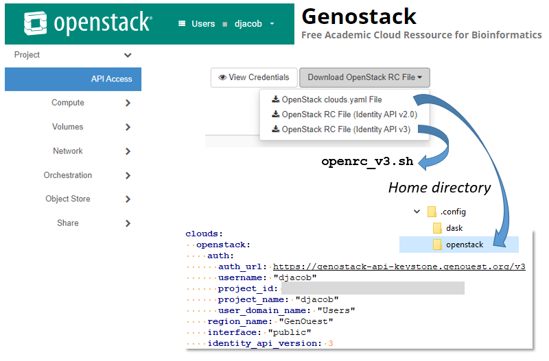
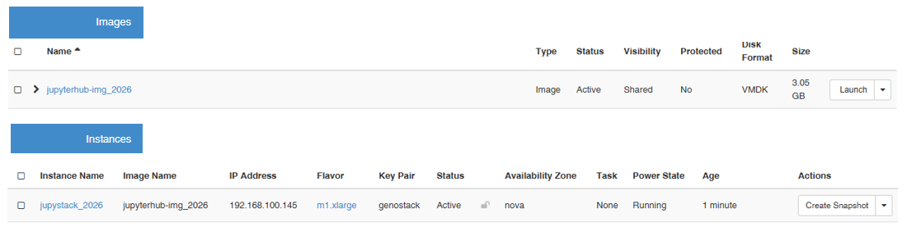
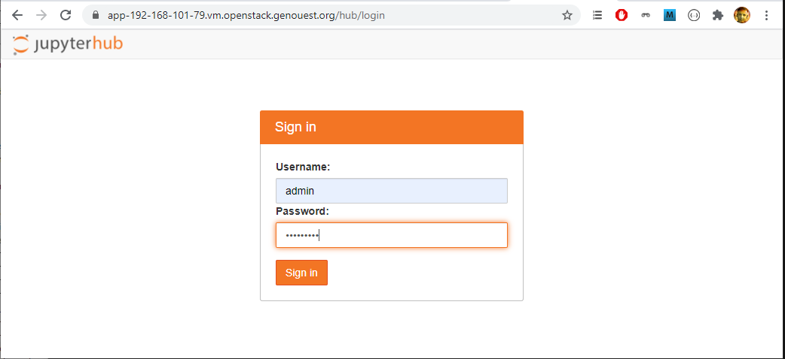

### About authentication to the OpenStack server 

To use an OpenStack cloud you need to authenticate against the Identity
service named keystone, which returns a **Token** and **Service Catalog**.
The catalog contains the endpoints for all services the user/tenant has
access to - such as Compute, Image Service, Identity, Object Storage, Block
Storage, and Networking (code-named nova, glance, keystone, swift,
cinder, and neutron).

Using the 3 *Identity API* does not necessarily mean any other
OpenStack API is version 3. For example, your cloud provider may implement
Image API v1.1, Block Storage API v2, and Compute API v2.0. OS_AUTH_URL is
only for the Identity API served through keystone.

The **clouds.yaml** file can be used by OpenStack tools as a source
of configuration on how to connect to a cloud. If this is your only cloud,
just put this file in ~/.config/openstack/clouds.yaml and tools like
python-openstackclient will just work with no further config. (You will need
to add your password to the auth section)
If you have more than one cloud account, add the cloud entry to the clouds
section of your existing file and you can refer to them by name with
OS_CLOUD=openstack or --os-cloud=openstack

You need to retrieve the **_clouds.yaml_** file from the **OpenStack dashboard** (web interface), in the "**API Access**" section via a dropdown menu located in the top right corner, as shown below:



<br>

### About the scripts

The scripts provided here are used to send an image and then create an instance on an OpenStack infrastructure (e.g. [Genouest OpenStack cloud](https://www.genouest.org/2017/03/02/cluster/)) from a virtual image on your disk space. This of course requires access to this infrastructure, as any other infrastructure for that matter.


**Requirements** : [_python-openstackclient_](https://pypi.org/project/python-openstackclient/6.6.0/) _v6.6.0_ and [_python-novaclient_](https://pypi.org/project/python-novaclient/18.11.0/) _v18.11.0_ tested under _Windows 11 25H2 64-bit_,  x64 processor, with [_Miniconda_](https://www.anaconda.com/docs/getting-started/miniconda/main) integrating _Python 3.10_.

**Note** : On Windows, you will need to uninstall the optional [_python-zunclient_](https://pypi.org/project/python-zunclient/) package if installed to remove certain unwanted messages about the '_fnct_' module (e.g., "_Could not load 'appcontainer_action_list': No module named 'fcntl'_").

<br>

* **push_cloud.sh** : Uploads a virtual disk to an OpenStack-type cloud service.

```
$ sh ./openstack/push_cloud.sh -h
usage: sh ./push_cloud.sh [-c <cloudname>] [-p <password>] [-d <vmdk file>] [-i <image name>] [-t]
     -c <cloudname>     : the entry in the clouds.yaml file (genostack by default)
     -p <password>      : password to have access on the cloud
     -d <vmdk file>     : the full path of the VM disk (./builds/ubuntu2204-disk001.vmdk by default)
     -i <image name>    : the image name of the VM once pushed on the cloud (jupyterhub-img_2026 by default)
     -t                 : flag indicating that it is just for testing cloud connection
```
<br>

* **instance_to_cloud.sh** : Creates an instance from a previously uploaded image. You must choose the keypair and flavor. This information is provided by specifying the _t_ option.
    * **Note** : You need to adapt the [user-data.txt](user-data.txt) file so that _/usr/local/bin/get-hostname_ script returns either the full instance name or the IP address, depending on the chosen openstack cloud and what is needed to access it on the Internet.

```
$ sh ./openstack/instance_to_cloud.sh -h
usage: sh ./instance_to_cloud.sh [-c <cloudname>] [-p <password>] [-i <image name>] [-s <instance name>] [-k <keypair>] [-f <flavor>] [-t]
     -c <cloudname>     : the entry in the clouds.yaml file (genostack by default)
     -p <password>      : password to have access on the cloud
     -k <keypair>       : genostack by default
     -f <flavor>        : m1.xlarge by default
     -i <image name>    : the image name of the VM once pushed on the cloud (jupyterhub-img_2026 by default)
     -s <instance name> : the instance name of the VM (jupystack_2026 by default)
     -t                 : flag indicating that it is just for testing cloud connection
```

*  After performing both operations, you should see the following information in the OpenStack dashboard:



For more details on the whole process, see https://inrae.github.io/jupyterhub-vm/cloud/

<br>

**Full script** : Once the tools are installed and the configuration is complete, the entire **workflow from the Base Box to a functional instance on the OpenStack cloud**, can be written as follows:

```
cd  ./jupyterhub-vm
time (
  # Openstack cloud - defined in ~/.config/openstack/clouds.yaml
  CLOUD=genostack
  OS_PASSWORD=<password>

  # Image and instance names
  IMAGE_NAME=jupyterhub-img_2026
  SERVER_NAME=jupystack_2026

  # Removes the previous image and instance on the cloud
  alias ostack="openstack --os-cloud=$CLOUD --os-password $OS_PASSWORD"
  ostack server delete $SERVER_NAME
  ostack image delete $IMAGE_NAME

  # Removes the previous vmdk file
  [ -f ./builds/ubuntu2204-disk001.vmdk ] && rm -f ./builds/ubuntu2204-disk001.vmdk

  # Builds the final VM, exports it, then destroys the VirtualBox virtual machine.
  time vagrant up | tee logs/vagrant.log
  time vagrant package --output ./builds/ubuntu2204-box.tar.gz | tee -a ./logs/vagrant.log
  vagrant halt -f; vagrant destroy -f ; rm -rf .vagrant/

  # Extracts the VM images (vmdk file) from the TAR archive, then removes the archive
  [ -f ./builds/ubuntu2204-box.tar.gz ] && (cd ./builds; tar xvzf ubuntu2204-box.tar.gz ./ubuntu2204-disk001.vmdk)
  [ -f ./builds/ubuntu2204-disk001.vmdk ] && rm -f ./builds/ubuntu2204-box.tar.gz

  # Push the VM image on the OpenStack cloud then create a running instance
  time sh ./openstack/push_cloud.sh -c $CLOUD -i $IMAGE_NAME -p $OS_PASSWORD | tee ./logs/${CLOUD}.log
  sh ./openstack/instance_to_cloud.sh -c $CLOUD -i $IMAGE_NAME -s $SERVER_NAME -p $OS_PASSWORD | tee -a ./logs/${CLOUD}.log
)

```
<br>

### Using JupyterHub

The first time you log in to JupyterHub via the web interface, you must enter the administrator's login and password. The administrator's login is _admin_ (configured in the file _ansible/roles/jupyterhub/tasks/install.yml_).



The password is to be set by entering it when logging in for the first time. Then, it is registered as a user account of the machine (Linux account). Thus, you will have to enter the same password for subsequent logins. To change it, you will have to connect to the VM via a console and change it with the command _passwd_.


[Additional document](https://inrae.github.io/jupyterhub-vm/gcpimg/PuTTY_WinSCP.pdf): Slides that show, step by step, how to copy data, scripts and notebooks to the shared folder of the Jupyterhub server, in a secure way (SCP) using PuTTY and WinSCP.

<br>

Please refer to the following online documentation:

<br>

### OpenStack Client

* OpenStackClient
  https://docs.openstack.org/python-openstackclient/latest/

* OpenStack Python SDK
  https://docs.openstack.org/mitaka/user-guide/sdk.html

* How to install OpenStackClient on Windows using Windows Subsystem for Linux OpenStack Hosting
https://destine-data-lake-docs.data.destination-earth.eu/en/latest/openstackcli/How-to-install-OpenStackClient-on-Windows-using-Windows-Subsystem-for-Linux-OpenStack-Hosting.html

* python-openstackclient 
  https://pypi.org/project/python-openstackclient/


<br>

### Acknowledgements

We would like to thank the [IFB GenOuest bioinformatics](https://www.genouest.org/2017/03/02/cluster/) for providing storage and computing resources on its national life science Cloud.

